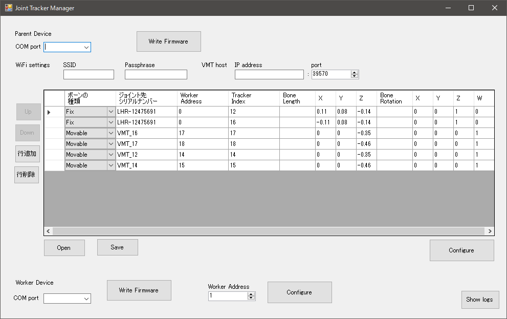

# JointTrackerManager

M5 StackでSteam VRにトラッカーを追加する[JointTracker](https://github.com/ixsiid/JointTracker)の管理用ソフトです

Firmwareの書き込み、各種設定等がGUIによって行うことができます

# 必要環境

- Python 3.5以上
- Joint Trackerデバイス

# 使い方

## Firmwareの書き込み

起動時に、Firmwareの書き込み必要なpythonモジュール **esptool**, **pyserial** がインストール済みかチェックされます

またJointTrackerのリポジトリからリリースバージョンに更新があればダウンロードされます

Firmwareを書き込む際は、COMポートを選んで、**Write Firmware** ボタンを押してください

進行状況は **Show logs** ボタンを押すと表示されます

## Parentデバイスの設定

Parentデバイスは、WiFi接続情報、Virtual Motion Trackerのホスト情報、ボーン構造を入力して、**Configure** ボタンを押してください

ボーン構造の詳細は [JointTracker](https://github.com/ixsiid/JointTracker) のドキュメントを参照してください

## Workerデバイスの設定

Workerデバイスは、各ボーンに対応したアドレスを設定します

Parent側と同様に **Worker Address** に入力して **Configure** ボタンを押してください

# お願い

かなり突貫で作成しているため、十分な環境依存性が確認できていません

不具合がありましたら、温かい目でIssuesを上げてもらえると助かります

# Keywords
Joint Tracker

